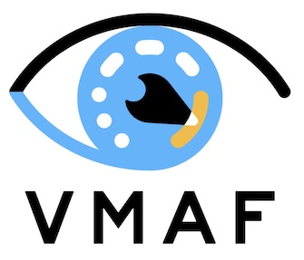

# VMAF — Lusoris Fork

[](https://github.com/lusoris/vmaf/actions/workflows/tests-and-quality-gates.yml)
[](https://github.com/lusoris/vmaf/actions/workflows/lint-and-format.yml)
[](https://github.com/lusoris/vmaf/actions/workflows/security-scans.yml)
[](https://github.com/lusoris/vmaf/actions/workflows/libvmaf-build-matrix.yml)
[](https://github.com/lusoris/vmaf/actions/workflows/ffmpeg-integration.yml)
[](LICENSE)
[](https://www.conventionalcommits.org)
[](https://securityscorecards.dev/viewer/?uri=github.com/lusoris/vmaf)
[](https://ko-fi.com/lusoris)

**A GPU-accelerated, full-precision, signed-release fork of
[Netflix/vmaf](https://github.com/Netflix/vmaf)** — perceptual video quality
assessment, Emmy-winning, now with:

- **SYCL / oneAPI** GPU backend (Intel, NVIDIA, AMD via Codeplay plugins),
  with a fp64-less device fallback path for Intel Arc / iGPU silicon.
- **CUDA** GPU backend (optimized ADM decouple fusion, VIF rd_stride,
  memory-efficient scoring).
- **Vulkan** GPU backend — vendor-neutral compute-shader path covering motion,
  motion2, motion3, ADM, VIF, PSNR, SSIM, MS-SSIM, PSNR-HVS, CAMBI; runs on
  any GLSL/SPIR-V capable device including lavapipe in CI. On Mesa ANV/RADV
  drivers, Vulkan **outperforms NVIDIA proprietary Vulkan** at every resolution
  tested (Arc A380 7,481 fps, AMD iGPU 7,481 fps, RTX 4090 6,362 fps at
  576×324 — see [Research-0092](docs/research/0092-perf-bench-multi-backend-2026-05-10.md)).
- **HIP (AMD ROCm)** GPU backend — 8 of 11 feature extractors have real device
  kernels (PSNR, float-PSNR, ANSNR, motion, motion\_v2, moment, SSIM,
  CIEDE2000); ADM and VIF pending a low-level API redesign. Requires
  `-Denable_hip=true -Denable_hipcc=true` and ROCm ≥ 7.
- **AVX2 / AVX-512 / NEON** SIMD paths for every hot kernel.
- **`--precision`** CLI flag — default `%.6f` matches upstream Netflix output
  (keeps the CPU golden gate green without per-call flags); `--precision=max`
  opts in to `%.17g` for IEEE-754 round-trip lossless scores. See ADR-0119
  (supersedes ADR-0006).
- **Tiny-AI** model surface (ONNX Runtime) for lightweight quality-proxy
  experiments — Netflix + KoNViD-1k combined-corpus trainer, LOSO eval
  harness, multi-seed validation, QAT + PTQ paths. See [`ai/`](ai/).
- **MCP servers** — both an in-process embedded scaffold
  ([`libvmaf/include/libvmaf/libvmaf_mcp.h`](libvmaf/include/libvmaf/libvmaf_mcp.h),
  flag `-Denable_mcp=true`) and the standalone Python JSON-RPC server
  under [`mcp-server/vmaf-mcp/`](mcp-server/vmaf-mcp/).
- **GPU-parity CI gate** — every PR runs a CPU ↔ Vulkan/lavapipe variance
  matrix across all features; CUDA / SYCL / hardware-Vulkan join when a
  self-hosted runner is registered. See
  [`docs/development/cross-backend-gate.md`](docs/development/cross-backend-gate.md).
- **Signed releases** — every tag carries SBOM (SPDX + CycloneDX), Sigstore
  keyless signatures, and SLSA L3 provenance.

Upstream Netflix/vmaf stays authoritative for the scoring algorithm; the fork
adds backends, tooling, and productization without changing the numerical
contract. The three Netflix CPU golden-data tests (1 normal + 2 checkerboard
pairs) run as a required CI gate on every PR — see
[`docs/principles.md`](docs/principles.md) §3.1 and decision D24.



## Quickstart

```bash
# One-liner dev env install (auto-detects Ubuntu/Arch/Fedora/Alpine/macOS/Win).
./scripts/setup/detect.sh

# CPU-only build + test.
meson setup build -Denable_cuda=false -Denable_sycl=false
ninja -C build
meson test -C build

# Score a pair.
build/tools/vmaf -r ref.yuv -d dis.yuv --width 1920 --height 1080 \
                 -p 420 -b 8 -m version=vmaf_v0.6.1 --precision=17
```

Add `-Denable_cuda=true` (requires `/opt/cuda`), `-Denable_sycl=true`
(requires oneAPI `icpx`), `-Denable_vulkan=true` (requires
`glslangValidator` + a Vulkan-capable ICD; lavapipe is sufficient), or
`-Denable_hip=true -Denable_hipcc=true` (requires ROCm ≥ 7 + `hipcc`)
to bring up a GPU backend. The embedded MCP server lands behind
`-Denable_mcp=true` (scaffold currently returns `-ENOSYS`; transports in
T5-2b).

## Backends at a glance

| Backend | Status | Notes                                                                                                                  |
| ------- | ------ | ---------------------------------------------------------------------------------------------------------------------- |
| CPU     | ✅     | Scalar + AVX2 + AVX-512 + NEON. Golden-data truth.                                                                     |
| CUDA    | ✅     | `/opt/cuda`, `nvcc`. Works on RTX 20xx and newer. `CU_STREAM_NON_BLOCKING` motion speedup (PR #702).                   |
| SYCL    | ✅     | oneAPI DPC++; Intel/NVIDIA/AMD via Codeplay; fp64-less device fallback for Arc / iGPU.                                 |
| Vulkan  | ✅     | Vendor-neutral compute shaders; runs on lavapipe in CI. Mesa ANV/RADV outperform NVIDIA proprietary Vulkan per bench.  |
| HIP     | 🔶     | 8/11 feature kernels real (`-Denable_hip=true -Denable_hipcc=true`); ADM + VIF pending low-level API redesign.         |
| Metal   | 💭     | Apple Silicon scaffold (8/17 real); `-Denable_metal=auto/enabled`; not prioritized, PRs welcome.                       |

Cross-backend numerical divergence is held to ≤ 2 ULP in double precision; see
[`/cross-backend-diff`](.claude/skills/cross-backend-diff/SKILL.md) for the
verification loop.

**FFmpeg integration:** 11 patches against `n8.1.1` cover all four GPU
backends and the DNN/tiny-model surface. Configure flags:
`--enable-libvmaf-{cuda,sycl,vulkan,hip}`. See
[`ffmpeg-patches/`](ffmpeg-patches/).

**Symbol visibility (PR #706,
[ADR-0379](docs/adr/0379-libvmaf-symbol-visibility.md)):**
`libvmaf.so` exports exactly **44 `vmaf_*` public symbols** — zero
leaked internal symbols (was 207 leaked, including libsvm, pdjson,
and SIMD kernel names).

**Compiler support:** GCC 16 is supported (PR #699,
[ADR-0376](docs/adr/0376-ffmpeg-patches-hip-backend-selector.md));
the `-Wreturn-mismatch` regression in Vulkan kernel sources was fixed.

## CLI additions (fork-only)

```text
--precision $spec
      score output precision
        N (1..17) -> printf "%.<N>g"
        max|full  -> "%.17g" (IEEE-754 round-trip lossless; opt-in)
        legacy    -> "%.6f" (default; matches upstream Netflix output)

--backend $name            cpu|cuda|sycl|vulkan|hip (auto-selects if omitted)
--no_cuda                  disable CUDA backend
--no_sycl                  disable SYCL/oneAPI backend
--sycl_device $unsigned    select SYCL GPU by index (default: auto)
--vulkan_device $integer   select Vulkan device by ordinal (required to enable Vulkan)
--gpumask: $bitmask        restrict permitted GPU operations

--tiny-model $path         load a tiny ONNX model alongside classic models
--tiny-device $string      auto|cpu|cuda|openvino|rocm (default: auto)
--tiny-threads $unsigned   CPU EP intra-op threads (0 = ORT default)
--tiny-fp16                request fp16 IO where the EP supports it
```

All upstream flags are preserved unchanged.

## Tiny AI

Lightweight perceptual-quality models trained and shipped in-repo, consumed
through a single ONNX Runtime-backed inference path inside libvmaf.

| # | Capability | What it is | Where it runs |
| --- | --- | --- | --- |
| C1 | **Custom FR models** | Tiny MLP regressor on the libvmaf feature vector → MOS. Drop-in for the upstream SVM. | libvmaf, `vmaf` CLI, ffmpeg `libvmaf` filter |
| C2 | **No-reference metrics** | Small CNN / MobileNet-tiny on the distorted frame alone. | libvmaf, `vmaf --no-reference`, ffmpeg filter |
| C3 | **Learned filters** | Residual CNN denoisers / sharpeners exposed through ffmpeg `vmaf_pre`. | ffmpeg `vmaf_pre`, `dnn_processing` |
| C4 | **LLM dev helpers** | Ollama-backed review / commit-msg / docgen helpers, never linked into libvmaf. | [`dev-llm/`](dev-llm/), `.claude/skills/dev-llm-*` |

- Training: [`ai/`](ai/) (`pip install -e ai && vmaf-train --help`).
- Inference runtime: [`libvmaf/src/dnn/`](libvmaf/src/dnn/) (C, ONNX Runtime).
- CLI usage: `vmaf --tiny-model model/tiny/vmaf_tiny_fr_v1.onnx [--tiny-device cuda]`.
- Meson flag: `-Denable_dnn=auto|enabled|disabled` (default `auto`).
- ffmpeg: apply [`ffmpeg-patches/*.patch`](ffmpeg-patches/) for
  `tiny_model=...` and the new `vmaf_pre` filter.
- Docs: [`docs/ai/`](docs/ai/).

## Documentation

- [`CLAUDE.md`](CLAUDE.md) — orientation for Claude Code sessions.
- [`AGENTS.md`](AGENTS.md) — same, for tool-agnostic agents
  (Cursor, Aider, Copilot).
- [`docs/principles.md`](docs/principles.md) — NASA Power-of-10, JPL, CERT,
  MISRA coding standard, Netflix golden gate, quality policy.
- [`docs/backends/`](docs/backends/) — per-backend overviews (CUDA, SYCL,
  Vulkan, x86, arm); SYCL bundling at
  [`docs/backends/sycl/bundling.md`](docs/backends/sycl/bundling.md).
- [`docs/development/cross-backend-gate.md`](docs/development/cross-backend-gate.md)
  — GPU-parity matrix CI gate (T6-8).
- [`docs/benchmarks.md`](docs/benchmarks.md) — fork-added benchmark numbers
  (GPU, SIMD, `--precision`).
- [`docs/ai/`](docs/ai/) — training, inference, LOSO eval, QAT/PTQ,
  benchmarks, security.
- [`docs/mcp/`](docs/mcp/) — embedded + standalone MCP server docs.
- [`CONTRIBUTING.md`](CONTRIBUTING.md) — how to contribute (fork-specific +
  upstream guide preserved).
- [`SECURITY.md`](SECURITY.md) — coordinated disclosure, SLA, supply-chain
  guarantees.
- [Netflix/vmaf upstream docs](docs/index.md) — FAQs, models, AOM CTC usage.

## Release & signing

Tagged releases use `vX.Y.Z-lusoris.N`, tracking upstream Netflix version +
fork suffix. Every release asset is:

- Signed with [Sigstore](https://sigstore.dev) keyless OIDC — verify with
  `cosign verify-blob --bundle <asset>.bundle <asset>`.
- Accompanied by SPDX and CycloneDX SBOMs.
- Backed by [SLSA L3](https://slsa.dev) provenance via
  `slsa-github-generator` — verify with `slsa-verifier`.

Release automation: [release-please](https://github.com/googleapis/release-please)
opens a PR on every push to `master`; merging it tags and fires signing.

## License

[BSD-3-Clause-Plus-Patent](LICENSE) — preserved from upstream Netflix/vmaf.

Fork-authored code (SYCL backend, `.claude/` scaffolding, MCP server, Tiny-AI
surface) is © 2024-2026 Lusoris and Claude (Anthropic), licensed under the
same BSD-3-Clause-Plus-Patent terms as the rest of the project.

## Attribution

Upstream: [Netflix/vmaf](https://github.com/Netflix/vmaf). The scoring
algorithm, Python training harness, and the 3 Netflix CPU golden test pairs
remain Netflix's. The fork wraps, extends, and hardens — it does not replace.

Fork maintainers: [Lusoris](https://github.com/Lusoris) and
[Claude (Anthropic)](https://www.anthropic.com/claude) — co-authored.

---

## Support the fork

If the fork saves you time, [ko-fi.com/lusoris](https://ko-fi.com/lusoris)
keeps the GPU bill paid and the test rigs running.

## Upstream news & history

See [`CHANGELOG.md`](CHANGELOG.md) for fork-specific changes and the
[upstream release history](https://github.com/Netflix/vmaf/releases) for the
core VMAF algorithm evolution (CAMBI, NEG mode, v3.0.0 API overhaul, etc.).
