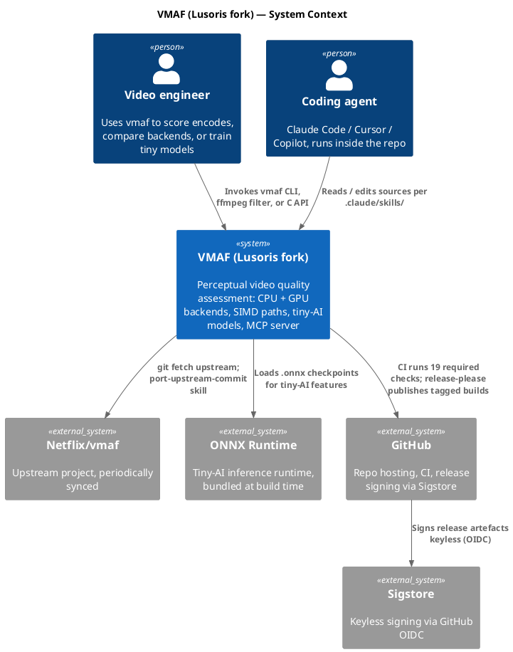

# C4 Level 1 — System context

> **Status.** Stub. Scaffolded 2026-04-17 as part of the golusoris-alignment
> sweep. Fill in actors, external systems, and data flows as the fork's user
> surfaces stabilise. See [index.md](index.md) for the repository map and
> [c4-container.md](c4-container.md) for Level 2.

## What is C4?

[C4 model](https://c4model.com) by Simon Brown — four levels of increasing
detail: **Context → Container → Component → Code**. This page is Level 1;
deeper levels live in sibling files as the system grows.

## System context diagram

> Render with `plantuml docs/architecture/c4-context.md` or any MkDocs
> plugin that understands PlantUML fenced blocks.

## External actors and systems

| Actor / system | Role |
| --- | --- |
| Video engineer | Primary human user — scores encodes, compares backends, trains tiny models |
| Coding agent | Claude Code, Cursor, Copilot, etc. — operates inside the repo per AGENTS.md / CLAUDE.md |
| Netflix/vmaf (upstream) | Origin of the codebase — periodic one-way syncs via `.claude/skills/sync-upstream/` |
| ONNX Runtime | Third-party dependency bundled for tiny-AI inference (see [ADR-0022](../adr/0022-inference-runtime-onnx.md)) |
| GitHub | Repo host + CI + release infrastructure (see [ADR-0037](../adr/0037-master-branch-protection.md)) |
| Sigstore | Keyless signing authority (see [ADR-0010](../adr/0010-sigstore-keyless-signing.md)) |

## Key constraints at this level

- Upstream compatibility — Netflix golden tests are the numerical
  correctness gate ([ADR-0024](../adr/0024-netflix-golden-preserved.md)).
- Multi-backend one-binary — one `libvmaf` dispatches to CPU / CUDA / SYCL
  at runtime; build-time flags gate which are compiled in.
- Deployment target is C-only — the public API has no mandatory Python /
  C++ runtime dependency.

## Next level

- [c4-container.md](c4-container.md) — container view (libvmaf, tools/,
  ai/, mcp-server/, model/, python/).
